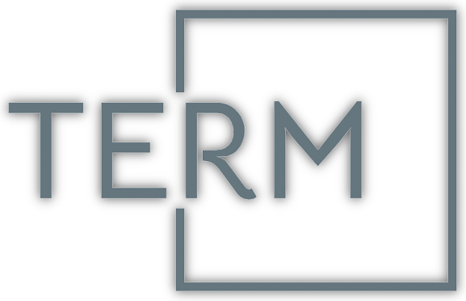

  

<h3 align="center">
    
    aims at providing a seamless and easy experience in developing terminal based user experiences. 
</h3>
       

    
    
    &nbsp;
    <!--
    &nbsp;
	
    &nbsp;
    
    &nbsp;
    
    &nbsp;
    
    !-->

                                                                                                
                                                                                                
